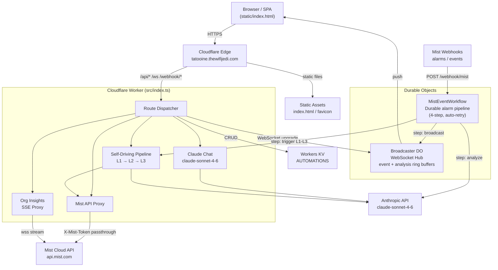
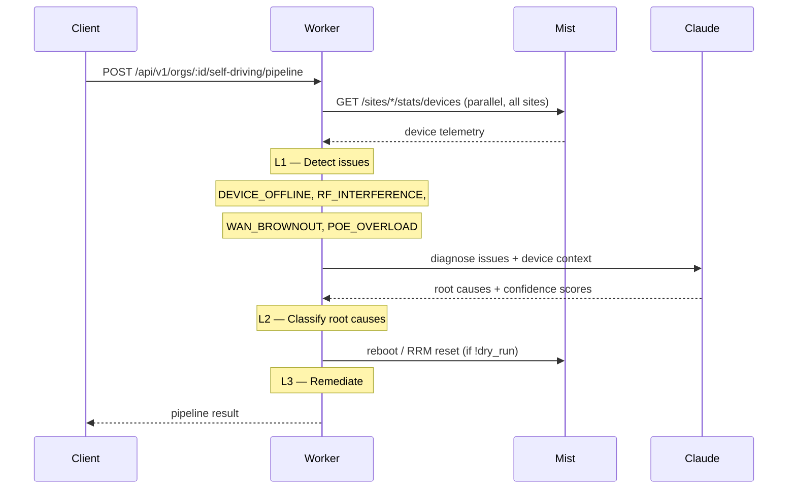
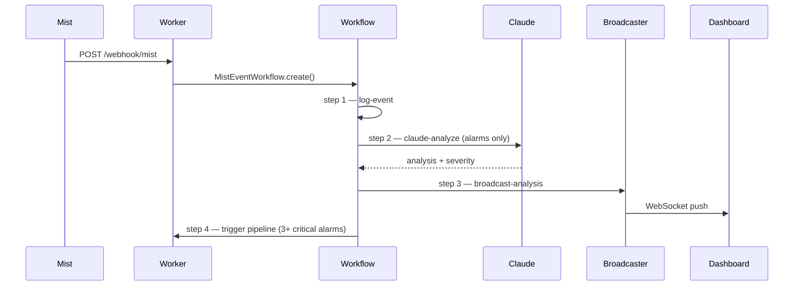

# Tatooine — Self-Driving Network Intelligence

**Mist Field PLM Hackathon 2026 · Self-Driving Network Track**

> Closes the loop from telemetry to action — detecting issues automatically, diagnosing root cause with Claude AI, and remediating problems without manual intervention.

**Live:** [https://tatooine.thewifijedi.com](https://tatooine.thewifijedi.com)

---

## Architecture



---

## Self-Driving Levels

| Level | Name | What it does |
|-------|------|-------------|
| **L1** | Detection | Polls live device stats across all sites in parallel; detects offline devices, RF interference, WAN brownouts, PoE overload, AP offline clusters |
| **L2** | Diagnosis | Claude AI classifies root cause with confidence scoring using real radio/WAN/PoE telemetry as context |
| **L3** | Remediation | Executes AP reboots, RRM resets, NOC escalations — dry-run safe by default |



---

## Webhook Pipeline



---

## Stack

| Component | Technology |
|-----------|-----------|
| Runtime | Cloudflare Workers (TypeScript, ES modules) |
| Frontend | Single-file HTML/CSS/JS SPA — light mode + KRAYT TERMINAL dark theme |
| AI | Anthropic Claude `claude-sonnet-4-6` |
| Real-time | Durable Object WebSocket Hibernation API (`Broadcaster`) |
| Alarm pipeline | Cloudflare Workflows — durable, auto-retry (`MistEventWorkflow`) |
| Automations store | Workers KV (`AUTOMATIONS` namespace) |
| Static files | Cloudflare Static Assets binding |

---

## Dashboard Tabs

| Tab | Description |
|-----|-------------|
| **Dashboard** | Network overview — Sites, APs, Switches, Gateways KPIs; site health table with 24h stats; live event feed; Marvis Actions; SLE scores |
| **AI Assistant** | Claude-powered chat with live Mist org access and tool use |
| **Access Points** | Live AP stats — radio channels, noise floor, clients per band, device detail modal |
| → Connected Clients | Wireless clients per site |
| **WLANs** | Org-level WLAN inventory |
| **Switches** | Switch fleet with PoE stats; port table + PoE utilization detail modal |
| → Connected Clients | Wired clients per site |
| **WAN / Gateways** | Gateway fleet with live WAN interface status + device event feed (last 24h) |
| **Access Assurance** | NAC rules — 802.1X, MAB, PSK |
| → Connected Clients | NAC-authenticated clients |
| **Self-Driving Pipeline** | L1→L2→L3 UI with progressive rendering and dry-run toggle |
| **AI Ops** | Webhook status, Claude analyses, live event feed |
| **Org Insights** | Live Mist WebSocket stream |
| **Audit Log** | Full org event history |

---

## Quick Start

```bash
git clone <repo>
cd tatooine-cf-worker
bash setup.sh     # installs Node.js, prompts for secrets, deploys
```

Or step by step:

```bash
npm install
wrangler secret put ANTHROPIC_API_KEY
wrangler secret put MIST_API_TOKEN       # optional server-side fallback
wrangler secret put WEBHOOK_SECRET       # optional webhook validation
wrangler deploy
```

See [START_HERE.md](START_HERE.md) for full setup instructions.

---

## API Reference

### Self-Driving Pipeline

| Endpoint | Level | Description |
|----------|-------|-------------|
| `GET /api/v1/orgs/:id/self-driving/scan` | L1 | Detect issues from live telemetry |
| `POST /api/v1/orgs/:id/self-driving/diagnose` | L2 | Claude root-cause analysis |
| `POST /api/v1/orgs/:id/self-driving/remediate` | L3 | Execute automated actions |
| `POST /api/v1/orgs/:id/self-driving/pipeline` | L1→L2→L3 | Full pipeline, single call |

### AI Chat

| Endpoint | Description |
|----------|-------------|
| `POST /api/v1/chat` | Stream Claude response with Mist tool use |

### Automations (KV-backed)

| Endpoint | Description |
|----------|-------------|
| `GET /api/v1/automations` | List all automations |
| `POST /api/v1/automations` | Create automation |
| `PUT /api/v1/automations/:id` | Update automation |
| `DELETE /api/v1/automations/:id` | Delete automation |

### Real-time

| Endpoint | Description |
|----------|-------------|
| `GET /ws` | WebSocket upgrade → Broadcaster DO |
| `GET /api/n8n/events` | Last 50 webhook events |
| `GET /api/n8n/analyses` | Last 20 Claude analyses |
| `GET /api/ws/status` | Connection count + buffer sizes |

### Webhooks

| Endpoint | Description |
|----------|-------------|
| `POST /webhook/mist` | Mist alarm/event receiver → Workflow |

---

## Auth

Token-only — paste a Mist API token into the UI. Org privileges are derived from `/self`. Multi-org tokens show an org picker. Token is held in session memory only, never stored server-side.

Session auto-expires after 5 minutes of inactivity with a 60-second countdown warning.

---

## UX Features

| Feature | Description |
|---------|-------------|
| **Mist API Counter** | Tracks cumulative API calls and total request time; progress bar turns amber at 50% and red at 80% of the 5000-call daily limit |
| **Session Timeout** | 5-minute inactivity timer with 60-second countdown before automatic sign-out |
| **Theme Toggle** | Light mode (default) and KRAYT TERMINAL dark mode |

---

## Security Headers

| Header | Value |
|--------|-------|
| `Strict-Transport-Security` | `max-age=31536000; includeSubDomains` |
| `Content-Security-Policy` | `default-src 'self'` + scoped directives |
| `X-Content-Type-Options` | `nosniff` |
| `X-Frame-Options` | `SAMEORIGIN` |
| `Referrer-Policy` | `strict-origin-when-cross-origin` |

---

## Project Structure

```
src/
└── index.ts        Worker — all routes, Broadcaster DO, MistEventWorkflow
static/
└── index.html      Single-page dashboard
setup.sh            One-shot setup script (Node.js + secrets + deploy)
wrangler.jsonc      Cloudflare Worker config
package.json        Dependencies: @anthropic-ai/sdk, wrangler
tsconfig.json       TypeScript config
```
